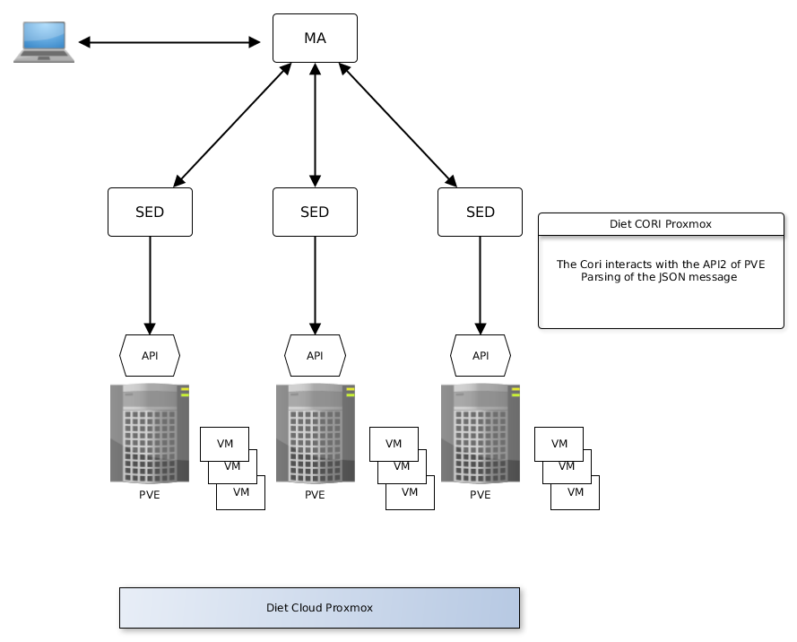

# REPO TUGAS KELOMPOK TCC
Anggota :   
Muhammad Najib  
Rizky Harya R  
Andri Siswanto  
Lukman Surya Laksana  
Dzikry Kusuma  
## Konsep
## Berbagai sofware IaaS
## Getting started PROXMOX
## Arsitektur dan konsep deplyment
  

komponen arsitektur tersebut 
Cluster PVE : Several clustered servers PVE.
PVE : Hypervisor Proxmox.
API : Proxmox VE uses a REST like API. This API use JSON as data format. The whole API is formally defined using JSON Schema.  