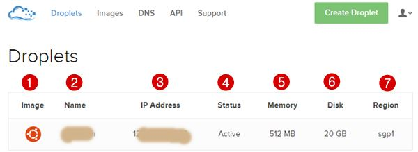

# REPO TUGAS KELOMPOK TCC
## Konsep

Gambar diatas adalah salah layanan IAAS. Disitu terlihat bahwa layanan cloud IaaS akan menyediakan satu unit berupa (lihat nomor diatas);

1. Sistem operasi – sistem operasi yang dipilih seperti Debian, Centos, Ubuntu dan semua OS Linux. Pada gambar diatas kebetulan saya memilih Ubuntu. Vendor cloud VPS (Virtual Private Server) DigitalOcean hanya menyediakan server untuk OS Linux
2. Nama – disini adalah nama server virtual
3. IP Address – pihak penyedia memberikan IP Address
4. Status Active – ini adalah menu untuk mengaktifkan atau menonaktifkan server
5. Memory, ini adalah layanan RAM yang berbeda-beda sesuai dengan spesifikasi yang dipilih, bisa 512MB, 1GB, 2GB dan seterusnya
6. Disk – dalam hal ini adalah tempat penyimpanan data, sama dengan 7. RAM, disesuaikan dengan spesifikasi yang dipilih
Region – ini adalah zona dimana kita memilih tempat. Banyak zona pusat seperti Singapura, New York, San Fransisco dan lain sebagainya. Ini digunakan sebagai alamat DNS. Terkadang sangat penting untuk bisnis online dengan target negara tertentu.

## Berbagai sofware IaaS
## Getting started PROXMOX
## Arsitektur dan konsep deplyment
